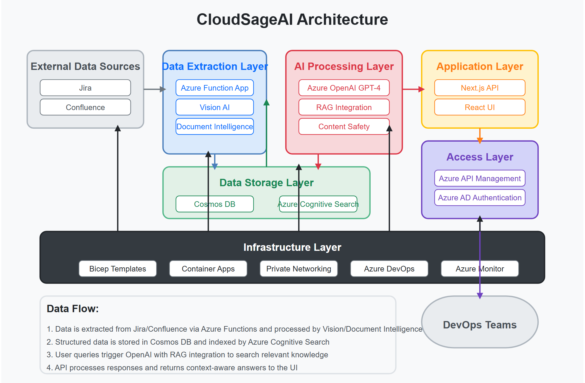

# **CloudSageAI - AI-Powered DevOps Assistant**


## **📌 Overview**
CloudSageAI is an AI-powered chatbot designed to assist DevOps and Cloud Engineering teams by leveraging **Jira & Confluence data** to provide instant, context-aware responses. The system integrates **Azure OpenAI (GPT-4-turbo), Azure Kubernetes Service (AKS), Azure Cognitive Search, Azure Cosmos DB, and Azure Function Apps** to process and retrieve relevant information from enterprise knowledge bases.

## **🎯 Objective**
### **Problem Statement**
DevOps and Cloud teams manage vast amounts of tickets, documents, and troubleshooting guides in **Jira & Confluence**. Searching for relevant documentation manually is time-consuming and inefficient.

### **Solution**
CloudSageAI addresses this issue by:

✅ Automatically extracting Jira & Confluence data and storing it in **Azure Cognitive Search & CosmosDB**.

✅ Enabling AI-driven search using **Retrieval-Augmented Generation (RAG)** with **Azure OpenAI GPT-4-turbo**.

✅ Providing an **interactive chatbot UI** that DevOps teams can query.

✅ Streaming AI-generated responses in real-time.

✅ Deploying fully automated infrastructure using **Bicep & Azure DevOps Pipelines**.

✅ Ensuring content safety using **Azure AI Content Safety** to prevent inappropriate queries.

✅ Leveraging **Azure API Management (APIM)** for secure and scalable API access.

✅ Extracting insights from **images & documents using Azure Vision and Document Intelligence**.

---

## **🛠️ System Architecture**




CloudSageAI consists of multiple cloud components:

### **1️⃣ Data Extraction Layer (Azure Function App)**
- **Extracts Jira & Confluence data** via APIs.
- **Processes images & documents using Azure Vision & Document Intelligence.**
- **Stores structured data** in **Azure Cognitive Search & CosmosDB**.
- **Runs on a schedule** to fetch **new or updated tickets & documents**.
- **Flattens complex data structures** for optimal search indexing.

### **2️⃣ AI Processing Layer (Azure OpenAI + Cognitive Search + AI Content Safety)**
- Uses **integrated Retrieval-Augmented Generation (RAG)** where Azure OpenAI automatically retrieves relevant documents from Azure Cognitive Search.
- **Azure AI Content Safety filters out inappropriate or harmful user inputs** before processing.
- **Vision & Document Intelligence extracts relevant text from images & PDFs.**
- **Private connections** between services ensure data security.

### **3️⃣ Chatbot UI (Next.js, React)**
- A **modern UI** that provides real-time AI responses.
- Integrated authentication using **Azure AD**.
- Secure, **RBAC-controlled access** for DevOps engineers.
- **Enhanced user experience** with proper message formatting and system indicators.

### **4️⃣ API Gateway & Security (Azure API Management)**
- **APIM is used to manage API requests securely.**
- **External teams can access APIs via APIM without exposing Container App services.**
- **Private DNS integration ensures internal routing between services.**

### **5️⃣ Infrastructure & Deployment (Bicep + Azure DevOps)**
- **Bicep templates** define and deploy infrastructure.
- **Azure DevOps Pipelines** automate deployment to **Azure Container Apps & Azure Function Apps**.
- **Docker images for UI & API are built and pushed to Azure Container Registry (ACR).**

---

## **📌 Deployment Guide**

### **1️⃣ Prerequisites**

1. **Azure Subscription** with Owner/Contributor access
2. **Azure DevOps Organization** with a project
3. **GitHub repository** with the CloudSageAI code
4. Install the following tools locally:
   - Azure CLI
   - Bicep
   - Docker
   - Git

### **2️⃣ Service Principal Creation**

1. Create an Azure service principal with Contributor access to your subscription:
   ```bash
   az ad sp create-for-rbac --name "CloudSageAI-SP" --role contributor --scopes /subscriptions/YOUR_SUBSCRIPTION_ID
   ```

2. Save the output containing `appId`, `password`, and `tenant`. You'll need these to configure Azure DevOps.

### **3️⃣ App Registration for Azure AD Authentication**

1. In the Azure Portal, navigate to **Azure Active Directory** > **App registrations** > **New registration**
2. Enter a name for your application (e.g., "CloudSageAI-Auth")
3. Select **Web** as the application type
4. Add a redirect URI: `https://your-ui-domain/api/auth/callback/azure-ad`
5. Under **Authentication**, enable **ID tokens**
6. Under **API permissions**, add the following Microsoft Graph permissions:
   - User.Read (delegated)
   - offline_access (delegated)
7. Under **Certificates & Secrets**, create a new client secret and save it securely

### **4️⃣ Configure Azure DevOps**

1. Create a new pipeline using the `azure-pipeline-complete.yml` file from your repository
2. Add the following service connections in Azure DevOps:
   - **Azure Resource Manager** connection named `CloudSageAI-SP` using the service principal created earlier
   - **Docker Registry** connection named `CloudSageAI-JC-ACR` pointing to your Azure Container Registry

3. Create the following pipeline variables:
   ```
   resourceGroupName: jc-chatbot-rg
   location: westeurope
   searchServiceName: jcchatbot-search
   functionAppName: jc-chatbot-api
   acrName: jcchatbotacr
   openaiName: jcchatbot-openai
   contentSafetyName: jc-chatbot-content-safety
   appInsightsName: jc-chatbot-app-insights
   cosmosdbName: jcchatbotcosmos
   ```

### **5️⃣ Environment Configuration**

1. Create the following environment variables in your API and UI configurations:
   
   **API Environment (.env.local):**
   ```
   AZURE_OPENAI_ENDPOINT=https://jcchatbot-openai.openai.azure.com/
   AZURE_OPENAI_API_KEY=<your-openai-api-key>
   AZURE_CONTENT_SAFETY_ENDPOINT=https://jc-chatbot-content-safety.cognitiveservices.azure.com/
   AZURE_CONTENT_SAFETY_KEY=<your-content-safety-key>
   AZURE_AD_CLIENT_ID=<app-registration-client-id>
   AZURE_AD_CLIENT_SECRET=<app-registration-client-secret>
   AZURE_AD_TENANT_ID=<your-tenant-id>
   APPINSIGHTS_INSTRUMENTATIONKEY=<app-insights-key>
   NEXTAUTH_URL=https://your-api-domain
   NEXTAUTH_SECRET=<random-secret-string>
   ```

   **UI Environment (.env.local):**
   ```
   NEXT_PUBLIC_API_BASE_URL=https://jc-chatbot-apim-jcapi.azure-api.net/chatbot
   AZURE_AD_CLIENT_ID=<app-registration-client-id>
   AZURE_AD_CLIENT_SECRET=<app-registration-client-secret>
   AZURE_AD_TENANT_ID=<your-tenant-id>
   APPINSIGHTS_INSTRUMENTATIONKEY=<app-insights-key>
   NEXTAUTH_URL=https://your-ui-domain
   NEXTAUTH_SECRET=<random-secret-string>
   ```

### **6️⃣ Run the Pipeline**

1. Run the Azure DevOps pipeline to deploy all infrastructure and applications
2. The pipeline will perform the following steps:
   - Deploy the search service
   - Create the search index
   - Deploy the base infrastructure including Cosmos DB, OpenAI, etc.
   - Build and push Docker images for the UI and API
   - Deploy the container apps
   - Deploy the function apps
   
### **7️⃣ Post-Deployment Configuration**

1. Configure the Azure OpenAI Studio:
   - Navigate to your OpenAI resource in the Azure Portal
   - Go to Azure OpenAI Studio
   - Under Model deployments, verify the gpt-4-turbo model is deployed
   - Add the data source to the model deployment:
     - Select "Add data source"
     - Choose "Azure Cognitive Search"
     - Connect to the search index created by the deployment
     - Test the RAG integration with sample queries

2. Verify data extraction:
   - Go to the Function App resource
   - Manually trigger the `fetch_data` function to extract initial data
   - Monitor the logs to confirm successful extraction
   - Trigger the `flatten_cosmos` function to prepare data for search indexing

3. Test the application:
   - Access the UI at your deployed URL
   - Verify that you can authenticate with Azure AD
   - Test various queries against your Jira and Confluence data

---

## **📌 How to Use CloudSageAI**

### **1️⃣ Accessing the Chatbot**

Open the CloudSageAI Web UI from your company's internal portal.

Sign in using Azure AD authentication.

Once logged in, the chatbot interface is displayed, ready for queries.

### **2️⃣ Asking Questions**

Enter a query such as:

"How was the last Kubernetes pod crash resolved?" (Fetches relevant Jira tickets.)

"What are our CI/CD security best practices?" (Retrieves Confluence documentation.)

"Summarize this architecture diagram." (Processes an uploaded image via Azure Vision.)

The chatbot responds with relevant results sourced from Jira, Confluence, and AI processing.

### **3️⃣ Uploading Files for Processing**

Users can upload screenshots, PDFs, or architecture diagrams.

CloudSageAI extracts text from:

Images (via Azure Vision AI)

PDFs & Documents (via Azure Document Intelligence)

The extracted content is processed and returned as a response.

### **4️⃣ Viewing API Logs & Metrics**

CloudSageAI logs all interactions in Azure Monitor & Application Insights.

DevOps teams can check:

Response times & API call performance.

Failure rates & issues in the function app logs.

User interactions & queries processed by AI.

### **5️⃣ Scaling & Managing CloudSageAI**

To scale the chatbot, increase the Container App replicas in Bicep.

If OpenAI API limits are reached, optimize queries via AI Content Safety filtering.

Storage & database usage can be monitored in CosmosDB & Azure Storage Metrics.

---

## **📂 File Structure**
This is the complete folder structure of the CloudSageAI project:

```
/cloudsageai
 ├── bicep/                    # Infrastructure as Code (Bicep files)
 │   ├── deploy.bicep          # Defines all Azure resources
 │   ├── search.bicep          # Deploys Azure Cognitive Search
 │   ├── container-apps.bicep  # Deploys Container Apps
 │   ├── parameters.json       # Parameter values for Bicep
 │
 ├── api/                      # Next.js API Backend
 │   ├── pages/api/
 │   │   ├── chat.js           # Handles chatbot API requests with RAG integration
 │   │   ├── auth.js           # Handles authentication (Azure AD)
 │   ├── .env.local            # API environment variables
 │
 ├── ui/                       # Next.js Frontend UI
 │   ├── pages/
 │   │   ├── index.js          # Enhanced Chatbot UI
 │   ├── .env.local            # UI environment variables
 │
 ├── function-app/             # Azure Function for Jira/Confluence Data Extraction
 │   ├── fetch_data.py         # Extracts & updates Jira/Confluence data, processes images & PDFs
 │   ├── .env.local            # Function App environment variables
 │
 ├── function-app-flatten/     # Azure Function for Data Flattening
 │   ├── flatten_cosmos.py     # Flattens complex data structures for search indexing
 │   ├── .env.local            # Function App environment variables
 │
 ├── k8s/                      # Kubernetes Deployment YAMLs (Alternative deployment)
 │   ├── deployment.yaml       # Deploys chatbot UI & API to AKS
 │   ├── service.yaml          # AKS LoadBalancer service
 │
 ├── pipelines/                # Azure DevOps CI/CD Pipeline
 │   ├── azure-pipeline.yml    # Automates deployment of Bicep, UI, and API
 │
 ├── README.md                 # Project documentation
```

---

## **📌 Example Use Cases**

### **Jira Use Cases**
1️⃣ **Troubleshooting Automation:** A DevOps engineer asks, "What was the resolution for the last Kubernetes pod crash?" The chatbot retrieves relevant Jira tickets that discuss past incidents and solutions.
2️⃣ **Change Management History:** A Cloud Engineer wants to know, "What changes were made to our Terraform infrastructure last month?" The chatbot provides a summary of Jira tickets related to Terraform changes.

### **Confluence Use Cases**
1️⃣ **Documentation Lookup:** A new SRE joins the team and asks, "How do we configure Azure AKS scaling?" The chatbot retrieves and summarizes the Confluence page detailing the AKS setup.
2️⃣ **Best Practices Guidance:** A DevOps lead asks, "What are our best practices for CI/CD pipeline security?" The chatbot pulls up relevant documentation from Confluence on secure DevOps practices.

### **Vision & Document Intelligence Use Cases**
1️⃣ **Extracting Insights from Architecture Diagrams:** A DevOps engineer uploads a Kubernetes architecture diagram, and the chatbot extracts relevant text & explanations from it.
2️⃣ **Processing PDF Reports & Logs:** A Cloud Engineer queries an old incident report stored as a PDF, and the chatbot retrieves relevant sections using Document Intelligence.

---

## **📊 Benefits of CloudSageAI**
✅ **Saves Time** – DevOps engineers no longer have to manually search Jira & Confluence.

✅ **AI-Powered Search** – Uses GPT-4-turbo with RAG for intelligent responses.

✅ **Real-Time Streaming** – Provides instant chatbot responses.

✅ **Automated Infra** – Bicep & Azure DevOps ensure smooth deployment.

✅ **Scalability** – Runs on Container Apps for high availability.

✅ **Security** – Uses Azure AD for authentication & RBAC for access control.

✅ **Ensures Safe AI Usage** – Azure AI Content Safety prevents harmful or inappropriate interactions.

✅ **Extracts Information from Images & PDFs** – Leverages Vision & Document Intelligence.

---

## **🚀 Future Enhancements**
1️⃣ **Vector Search Integration** – Add embedding generation and vector search for improved semantic matching.
2️⃣ **Streaming Responses** – Implement streaming API responses for real-time display of generated text.
3️⃣ **Multi-Modal Support** – Add ability to upload and process various file types inline in the conversation.
4️⃣ **Fine-Tuning** – Fine-tune the OpenAI model on organization-specific data for better responses.
5️⃣ **Team-Specific Knowledge Bases** – Configure multiple search indexes for different teams or domains.

---

## **🔧 Troubleshooting**

### Common Issues

1. **Authentication Failures**
   - Ensure the App Registration has the correct redirect URIs
   - Verify that the client ID and secret are properly configured

2. **Search Not Returning Results**
   - Check that the data extraction Function App is running properly
   - Verify that the flatten function is correctly processing data
   - Test the search index directly in the Azure Portal

3. **OpenAI Integration Issues**
   - Ensure the OpenAI model deployment is properly configured
   - Verify that the data source connection is established
   - Check the system prompt for guiding the model to use retrieved content

---

## **📃 License**
This project is licensed under the MIT License - see the LICENSE file for details.

---

## **👥 Contributors**
- [Santosh Nellutla](https://github.com/sknellutla919)

---

💡 **This project revolutionizes how DevOps teams access documentation!** 🔥🚀